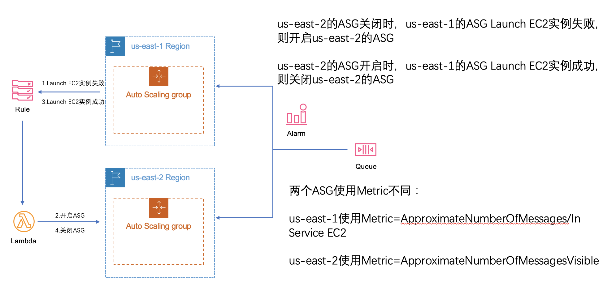

# 跨Region AutoScalingGroup解决方案

当一个region的spot实例不足导致无法启动spot EC2实例时，启动临近region的EC2 spot实例，从而达到最佳性价比。本文假设使用region为Virginia，利用AWS跨region是骨干网的特性，在Virginia不能启动G4dn.xlarge实例时，从Ohio启动G4dn.xlarge实例。当Virginia的G4dn.xlarge实例有库存后，再逐渐将用量切回Virginia。

## 架构图



在us-east-1和us-east-2分别创建2个auto scaling group，分别名为virginiaASG和ohioASG。当us-east-1扩展spot G4失败时，触发lambda，将us-east-2的ASG扩展策略开启。默认生产环境在us-east-1的ASG，配置Cloudwatch rule当us-east-1的ASG中EC2实例启动失败，则通过lambda启动us-east-2上的ASG，并且关闭原有监测EC2实例启动失败的Cloudwatch rule，启动监测us-east-1的ASG中EC2启动成功的Cloudwatch Rule。当检测到us-east-1的ASG启动EC2实例成功，则通过Cloudwatch Rule关闭us-east-2的ASG，并且关闭原有监测EC2实例启动成功的Cloudwatch rule，启动监测us-east-1的ASG中EC2启动失败的Cloudwatch Rule。us-east-1 ASG使用更为精准的Metric，使用SQS的ApproximateNumberOfMessages值，除以ASG中In Service EC2数量，计算出每台EC2最佳处理任务的数量，使用target tracking scaling policy，使每台EC2处理任务保持最佳。us-east-2 ASG使用approximatenumberofmessagesvisible作为metric。

### 创建ASG用的Metric

us-east-1使用自定义Metric，根据官方文档https://docs.aws.amazon.com/zh_cn/autoscaling/ec2/userguide/as-using-sqs-queue.html，在使用SQS队列作为Metric，target tracking scaling作为策略时，建议使用每台EC2的处理任务数量作为Metric，获取方式如下：
使用 SQS获取队列属性 (https://docs.aws.amazon.com/cli/latest/reference/sqs/get-queue-attributes.html)命令获取在队列中等待的消息数 (ApproximateNumberOfMessages)
```
aws sqs get-queue-attributes --queue-url https://sqs.region.amazonaws.com/123456789/MyQueue \
--attribute-names ApproximateNumberOfMessages
```
